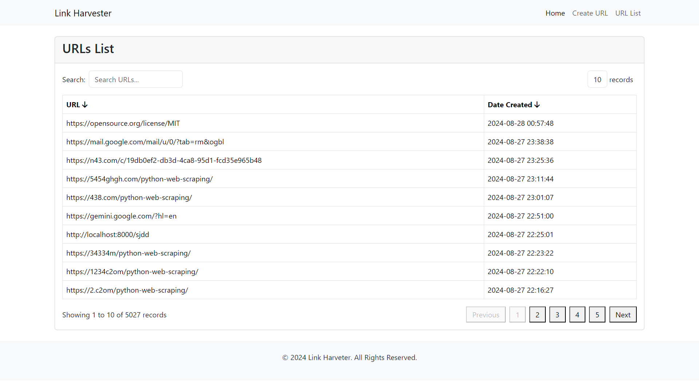
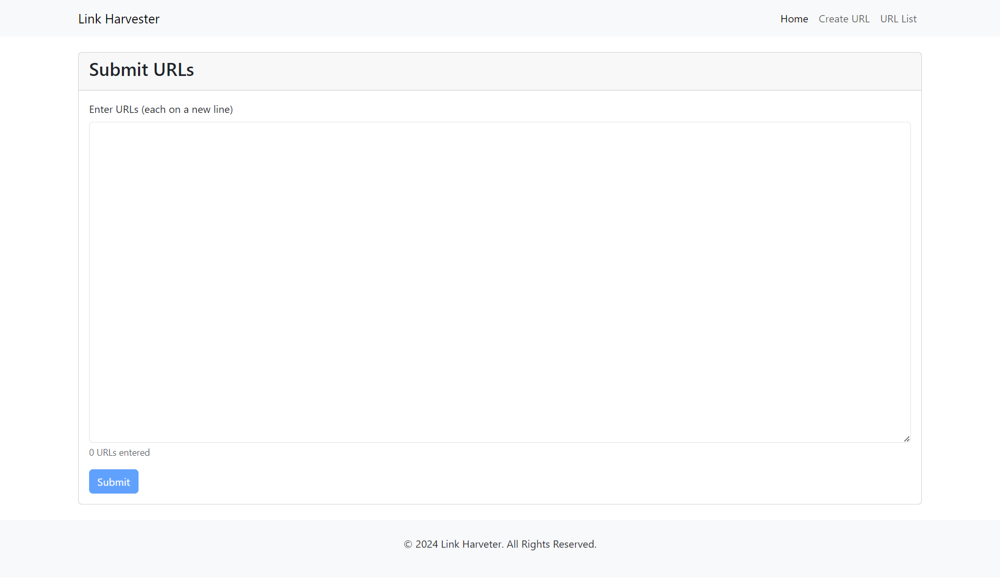
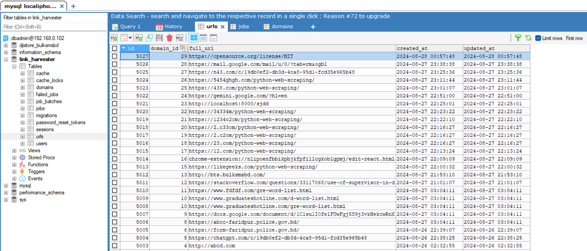
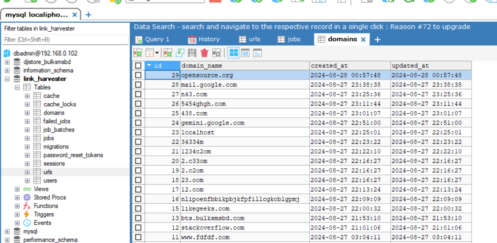

<p align="center"><a href="https://laravel.com" target="_blank"></a></p>

<p align="center">
<a href="https://github.com/laravel/framework/actions"></a>
<a href="https://packagist.org/packages/laravel/framework"></a>
<a href="https://packagist.org/packages/laravel/framework"></a>
<a href="https://packagist.org/packages/laravel/framework"></a>
</p>

## About the Project

This project is a Laravel-based application designed to process and insert URLs into a database. The application is containerized using Docker, manages queue workers with Supervisor. The front-end is enhanced using Alpine.js & Bootstrap.

## Table of Contents

- [Prerequisites](#prerequisites)
- [Installation](#installation)
- [Configuration](#configuration)
- [Building the Docker Image](#building-the-docker-image)
- [Running the Application](#running-the-application)
- [Managing the Queue Worker](#managing-the-queue-worker)
- [Screenshots](#screenshots)
- [Useful Docker Commands](#useful-docker-commands)
- [License](#license)

## Prerequisites

Before getting started, ensure that you have the following tools installed:

- [Docker](https://www.docker.com/)
- [Docker Compose](https://docs.docker.com/compose/install/)
- [Git](https://git-scm.com/)

## Installation

1. **Clone the Repository**

   ```bash
   git clone https://github.com/murad034/link-harvester.git
   cd link-harvester

2. **Copy the `.env` file**

   ```bash
   cp .env.example .env

3. **Update Environment Variables**

    Open the .env file and update the necessary environment variables, including database credentials.

## If the below command is not working for not building the docker image, go to #10 and #11 then again run the below

5. **Install Composer Dependencies**

   ```bash
   docker run --rm -v $(pwd):/var/www/html link_harvester composer install

6. **Generate the Application Key**
    ```bash
    docker run --rm -v $(pwd):/var/www/html link_harvester php artisan key:generate

7. **Run database migration for creating tables**
    ```bash
    docker run --rm -v $(pwd):/var/www/html link_harvester php artisan migrate

8. **Install Front-End Assets**
    ```bash
    docker run --rm -v $(pwd):/var/www/html link_harvester npm install
   
9. **Build Front-End Assets(For Development)**
    ```bash
    docker run --rm -v $(pwd):/var/www/html link_harvester npm run dev

10. **Build Front-End Assets(For Production)**
     ```bash
     docker run --rm -v $(pwd):/var/www/html link_harvester npm run build


## Configuration

<p>Docker Setup</p>
The Docker setup for this project is managed through the `docker-compose.yml` file. It configures two primary services:

app: This service runs the Laravel application using PHP 8.2 with Apache It is responsible for serving the application and includes volume mounts for the code and environment variables for configuration

db: This service runs a MySQL database container, which the Laravel application uses to store and retrieve data. It includes environment variables for database configuration and persists data using Docker volumes.

Make sure to adjust the environment variables in the docker-compose.yml file according to your local setup, such as database credentials and host information.

## Supervisor Configuration

The Supervisor configuration is used to manage background processes for the application. The configuration is specified in supervisord.conf, where it defines:

Apache Server: Managed by Supervisor to ensure it runs continuously in the foreground.

Laravel Queue Worker: Configured to process background jobs. Supervisor ensures that the worker process starts automatically and restarts if it crashes.

## Building the Docker Image

10. **To build the Docker image for the application, run**
    ```bash
    docker-compose build

## Running the Application
11. **To start the application and services, run**
    ```bash
    docker-compose up -d

12. **This command will start the application in detached mode. You can check the logs with:**
    ```bash
    docker-compose logs -f
  

## Screenshots
 <p>Below are some screenshots of the application:</p>
 
 <p>Application Overview</p>
 
 <p>URL List</p>
 
 
 
 <p>Create URL</p>
 
 
 
 <p>DB URL Tabel</p>
  
 
 
 <p>DB Domain Table</p>

 
 

## Overview Video

<p>Below is the overview video of the application:</p>
<a href="https://www.awesomescreenshot.com/video/30913586?key=54690a0c2b58df40480cf84e74f96261">Watch the video</a>

<video width="600" controls>
   <source src="images/overview.webm" type="video/webm">
   Your browser does not support the video tag.
</video>
 


## Useful Docker Commands
<p>Here are some useful Docker commands for managing your application:</p>

13. **Useful command to build the Docker Image:**

    ```bash
    docker-compose build
    docker-compose up -d
    docker-compose down
    docker-compose logs -f
    docker system prune -a
    docker ps
    docker images
    docker rmi -f d4d(Image ID)
    docker-compose exec app php artisan optimize:cache
    wsl
    sudo su
    docker-compose exec app supervisorctl reread
    docker-compose exec app supervisorctl update
    docker-compose exec app supervisorctl restart laravel-worker:*

#License
This project is licensed under the [MIT License](https://opensource.org/license/MIT)
